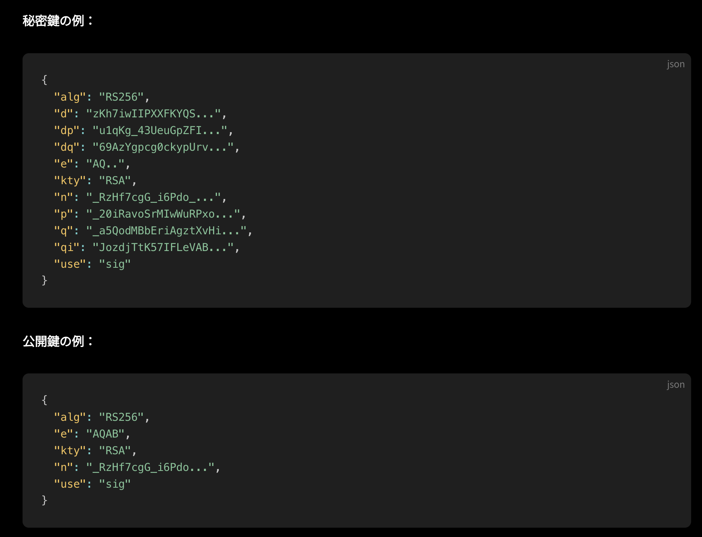
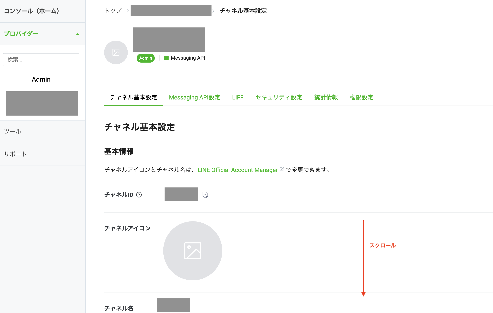
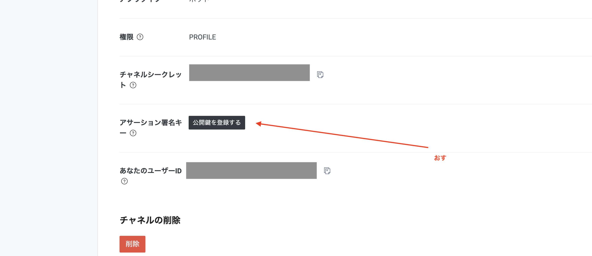
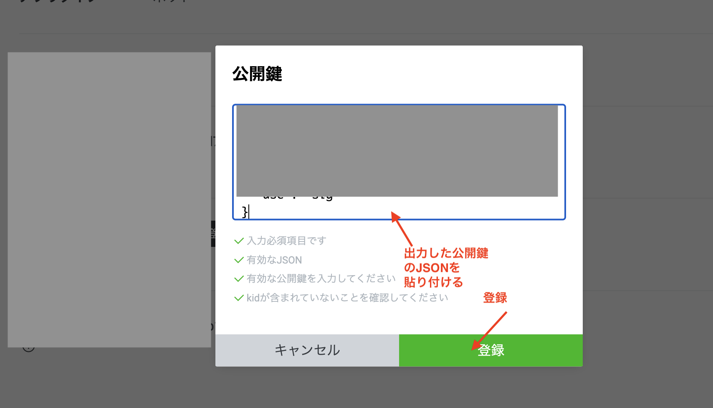
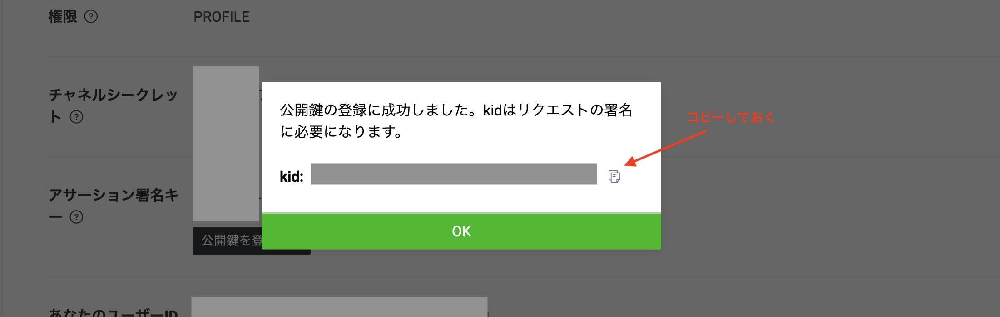
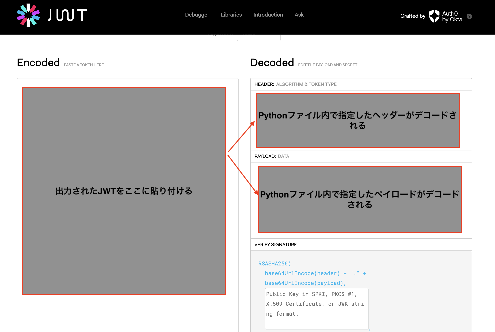

# line-messaging-api の利用におけるチャネルアクセストークンv2.1を発行

## 手順

### アサーション署名キーを発行する
- https://developers.line.biz/ja/docs/messaging-api/generate-json-web-token/#create-an-assertion-signing-key
- JWCrypto（Pythonのライブラリ）でキーペアを生成する
    ```sh
    # Makefileを作成しているので、下記コマンドで一撃
    make run
    ```
- 秘密鍵と公開鍵のキーペアが作成される
  - 下記のように出力されているはず。キャプチャの例は[公式](https://developers.line.biz/ja/docs/messaging-api/generate-json-web-token/#use-python)から拝借。
  - 公開鍵部分のJSONをコピーしておく


### Kidを取得する
- 公開鍵を登録する
  - 公式にのっとります
    - ［チャネル基本設定］タブをクリック
    
    - 次に、アサーション署名キーの横にある［公開鍵を登録する］ボタンをクリック
    
    - 公開鍵を入力し、［登録］ボタンで登録を確定します。
    
    - kid が発行される
    

### JWTを生成する
- PyJWT（Pythonのライブラリ）でJWTを生成していきます
- Pythonファイルは公式を参考に作成してあります。
    ```sh
    # 下記のMakeコマンドでJWTが出力される
    make issue-jwt
    ```
- 出力されたJWTが正しいかどうかはJWTの公式サイトでデコードして確認する
https://jwt.io/


### チャネルアクセストークンv2.1を発行する
- 公式のサンプルでPostします。curlコマンドがない方はPostmanなどでリクエストを送信すると良いと思います。
- 送信したら下記の

```sh
# {JWT}の部分を丸ごと発行したJWTで書き換えてください
curl -v -X POST https://api.line.me/oauth2/v2.1/token \
-H 'Content-Type: application/x-www-form-urlencoded' \
--data-urlencode 'grant_type=client_credentials' \
--data-urlencode 'client_assertion_type=urn:ietf:params:oauth:client-assertion-type:jwt-bearer' \
--data-urlencode 'client_assertion={JWT}'

# ↓↓↓↓↓↓↓↓↓↓↓↓ 実行後 ↓↓↓↓↓↓↓↓↓↓↓↓↓↓

# こんな感じでチャネルアクセストークンとキーIDのペアが帰ってきます
{
	"access_token": "************",
	"token_type": "Bearer",
	"expires_in": 2592000,
	"key_id": "********"
}
```